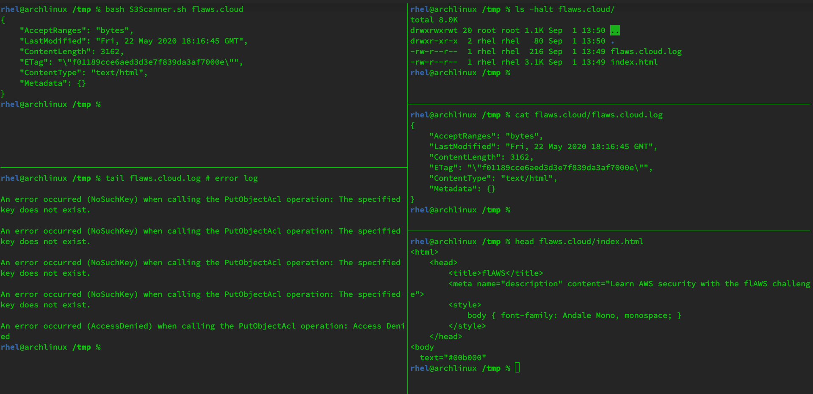

# S3Scanner
It's a simple bash script to automate scanning Amazon S3 Buckets.

### Prerequisite
[Install](https://docs.aws.amazon.com/cli/latest/userguide/install-cliv2-linux.html) and [configure](https://docs.aws.amazon.com/cli/latest/userguide/cli-chap-configure.html) [AWS CLI](https://aws.amazon.com/cli/)


### Usage
```bash
S3Scanner.sh <bucket-name> [--all|all]
```
Adding `--all` or `all` as last argument also checks [put-bucket-acl](https://docs.aws.amazon.com/cli/latest/reference/s3api/put-bucket-acl.html).



It immediately creates a directory with the same name as bucket name. In case it finds something, they're stored in the directory. If not, the directory is simply deleted. The error log is stored inside `/tmp` with as `<bucket-name>.log`

### References
https://labs.detectify.com/2017/07/13/a-deep-dive-into-aws-s3-access-controls-taking-full-control-over-your-assets/

